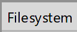

## Сборка FreeType

FreeType - это зависимость HarfBuzz-a. Он будет построен вместе с прочими зависимостями HarfBuzz-a.

### Наши изменения во FreeType

#### Patch для x64 windows 

(*258824f2ba2a3a1cd69c3ad68112283f8c885f09*)

Мы используем FreeType через SharpFont, который является частью DynamicFont-а.
С этим есть опредёлённые проблемы. SharpFont маршалит `long` как `IntPtr`. Это прекрасно работает в сборках движка под Windows(x86), MacOS(x64), iOS(x64), Android(x64). Однако это не работает для сборки движка под Windows(x64)

In the Unix world, there were a few possible arrangements for the sizes of integers and pointers for 64-bit platforms. The two mostly widely used were ILP64 (actually, only a very few examples of this; Cray was one such) and LP64 (for almost everything else). The acronynms come from 'int, long, pointers are 64-bit' and 'long, pointers are 64-bit'.

```c
Type           ILP64   LP64   LLP64
char              8      8       8
short            16     16      16
int              64     32      32
long             64     64      32
long long        64     64      64
pointer          64     64      64
```

For 64-bit systems, the primary Unix 'de facto' standard is LP64 — long and pointer are 64-bit (but int is 32-bit). The Windows 64-bit standard is LLP64 — long long and pointer are 64-bit (but long and int are both 32-bit).

Это не ошибка FreeType-а, это ошибка SharpFont-а.

Ребята из SharpFont-а предлагают исправлять это через **патч, который применяется к FreeType-у**. Собственно это мы и сделали с FreeType-ом. Этот патч заменяет `long` на `__int64` в некоторых местах. Это опасное изменение, о котором нужно помнить.

В будущем нужно исправить SharpFont, который интегрирован в наш движок, и ревертнуть патч из FreeType-а. Текстовый поиск Visual Studio выдал ~600 мест в DynamicFont, которые потенциально придется изменить.

#### Поддержка субпиксельного рендеринга

(*d9501bb52fd802883806ab0d724dcb8c4c699689*)

В `ftoption.h` включен дефайн `FT_CONFIG_OPTION_SUBPIXEL_RENDERING`.

Можно увидедеть результат работы этой опции, если сделать скриншот текста в движке. Нужно задать масштаб картинки > 200%


