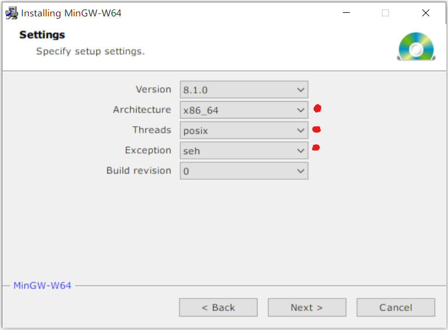
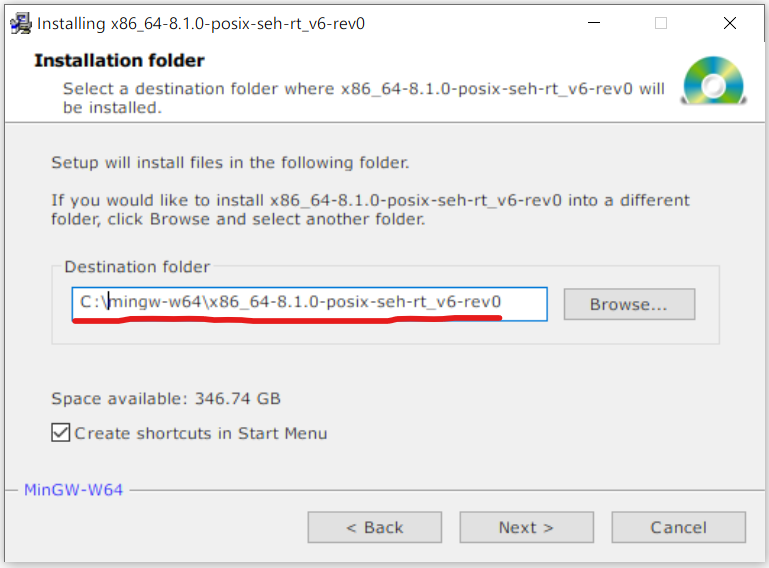

## Сборка HarfBuzz и его зависимостей

### Шаги сборки

1. [Скачать репозиторий HarfBuzz-а](###Скачать-репозиторий-HarfBuzz-а)
2. [Установить mingw-w64](###Установить-MinGW-w64)
3. [Установить Meson](###Установить-Meson)
4. [Запустить сборку через Meson](###Запустить-сборку-через-Meson)

### Скачать репозиторий HarfBuzz-а

Мы используем свой форк HarfBuzz-a: https://gitlab.game-forest.com:8888/Common/3rdparty/harfbuzz.

Также в нашем gitlab репозитории содержатся форки зависимостей HarfBuzz-a.

Для сборки HarfBuzz-a нужно выкачать только наш форк.

**Остальные зависимости установятся автоматически.**

### Установить MinGW-w64

MinGW-w64 распространяется через SourceForge.net

https://sourceforge.net/projects/mingw-w64/files/mingw-w64/mingw-w64-release/

При установке нужно выбрать следующие опции (см. таблицу и скриншот):

| Опция        | Значение |
| ------------ | -------- |
| Architecture | x86_64   |
| Threads      | posix    |
| Exception    | seh      |

После этого необходимо выбрать расположение для MinGW

**Важно!** В пути к MinGW не должно быть пробелов. В ином случае вы получите ошибку во время компиляции одной из библиотек зависимостей HarfBuzz-a.

### Установить Meson

Meson - это система сборки.

https://mesonbuild.com/Getting-meson.html

На данный момент это основной способ сборки HarfBuzz-a.

У HarfBuzz-а много опций и библиотек зависимостей.

Meson автоматически скачает и соберёт все зависимости.

Управлять зависимостями нужно через опции.

В нашем форке HarfBuzz-a всё уже настроено.

### Запустить сборку через Meson

Чтобы начать сборку HarfBuzz-а, нужно запустить скрипт `build-for-citrus-win64.sh`

Для этого открываем директорию, в которую установили MinGW (для меня это `C:\mingw-w64\x86_64-8.1.0-posix-seh-rt_v6-rev0`). В этой директории должен лежать файл `mingw-w64.bat`. Нужно заменить последнюю строчку в этом файле (`"C:\WINDOWS\system32\cmd.exe"`) на путь к `git bash` (для меня это `"C:\Program Files\Git\git-bash.exe"`). После этого запускаем `mingw-w64.bat`.

Должно открыться окно gitbash. Вместе с ним может открыться окно cmd, которое можно сразу закрыть. В открывшемся gitbash-e переходим в директорию с HarfBuzz-ом (для меня это `C:\Users\dshcherbina\Desktop\harfbuzz`).

Теперь нужно запустить скрипт:`sh .\ci/build-for-citrus-win64.sh`

Этот скрипт должен отработать без ошибок.

В результате его работы должен получиться набор библиотек в `...\harfbuzz\win32build\harfbuzz-win32\`

