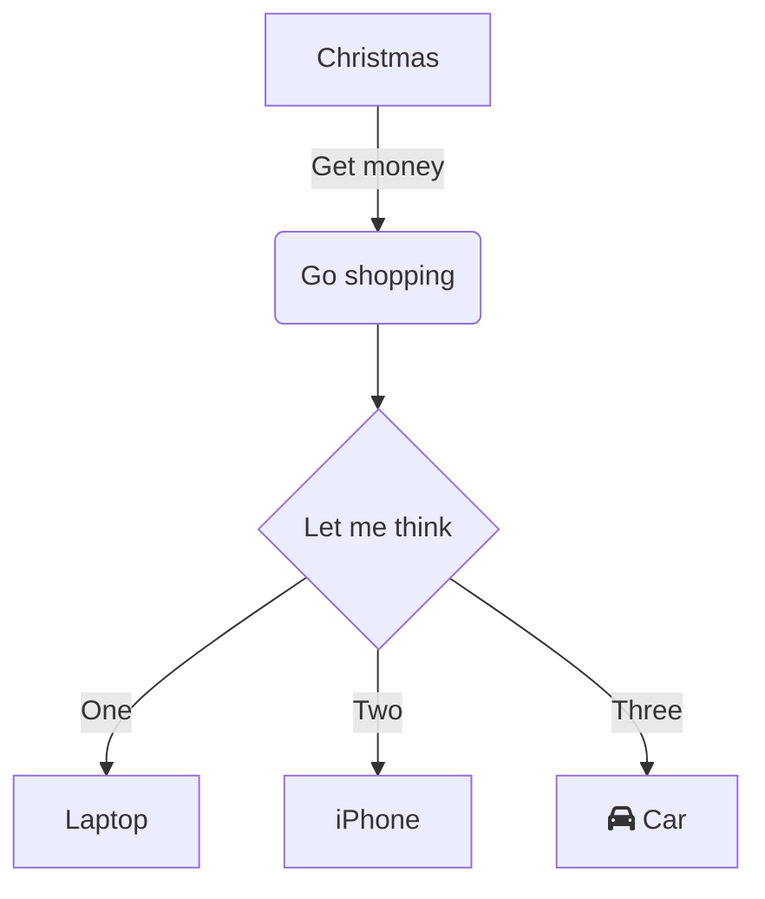

# Citrus Engine

Citrus is a game engine. Major engine components are named after Citrus fruits:

- Lemon - bindings for native 3rd party libraries.
- Lime - engine core
- Yuzu - serialization library
- Orange - builder application
- Kumquat - code generator
- Tangerine - scene editor

https://github.com/tylerbutler/FluidFramework/commit/2597379ae57b5a01aee33fff9482d64ae1212c01#diff-cf2a02b7ba760f1160fc918b8f2b175dad122a4fd64790689e7cf6e3b9ed0fed

https://github.com/dotnet/docfx/issues/2292
