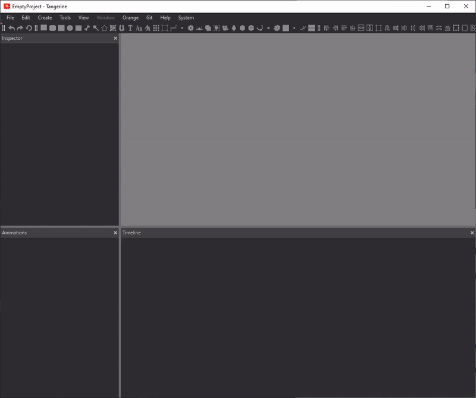
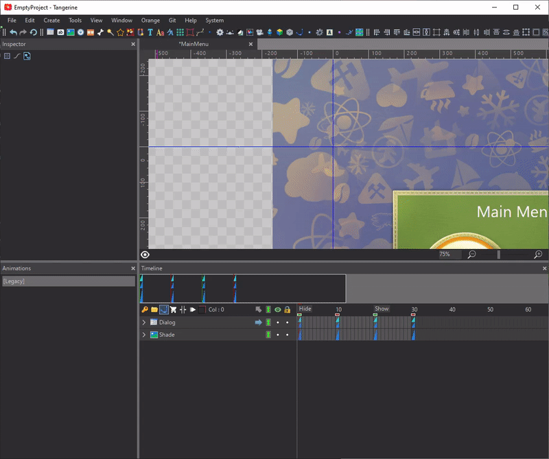
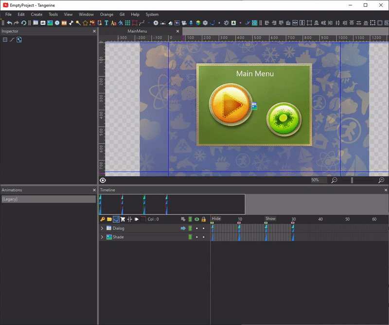
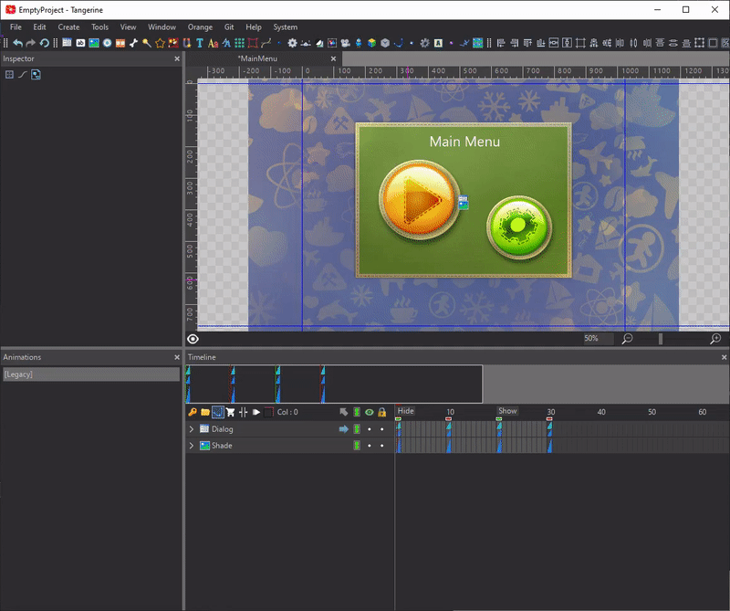

# Maximizing your efficiency in Tangerine — lookup

Lookup is a Tangerine feature that makes it simple to execute commands, open files and quick jump to nodes, components, animations, markers and frames.

## Instructions

Use the default `Ctrl+Shift+P/Cmd+Shift+P` keyboard shortcut or `File/Open Lookup Dialog` command.

## For possible options type `?` to open the `Help Menu`

## Go to `Command` by typing `>`

## Go to `File` by typing `f:`

Type `f:` to find files in the current workspace. You can open scenes in a `new tab` or insert scenes, images and sounds to the current document.

## Go to `Node` by typing `n:`

## Go to `Component` by typing `c:`

## Go to `Animation` by typing `a:` or `ad:`

Type `a:` to find animations of the current container or `ad:` to find animations in current document.

## Go to `Marker` by typing `m:` or `md:`

Type `m:` to find markers in the current animation or `md:` to find markers in current document.

## Go to `Frame` by typing `:`

Type `:` and the frame number to jump to the corresponding frame.

## Assign a keyboard shortcut to any Lookup function

Go to the `Keyboard shortcuts` tab in the `Preferences` and assign a keyboard shortcut to any Lookup function (Lookup Commands, Lookup Files and etc) in `Generic Commands` section.
