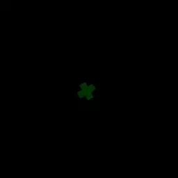
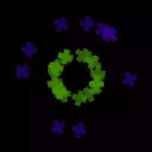

# Emission Method - что это такое и как этим пользоваться

`EmissionMethod` - это свойство виджета типа `ParticleEmitter`. От метода эмиссии зависит, по какому принципу частицы будут "вылетать" из эммитера.

Доступны следующие типы эмиссии:

* NumberPerSecond
* ConstantNumber
* NumberPerBurst

`Number` свойство эмиттера, которое определяет количество частиц, по-разному в зависимости от метода эмиссии.

Оба этих свойства могут быть анимированы.

## NumberPerSecond

Частицы генерируются непрерывно каждый кадр так, что за секунду генерируется `Number` количество частиц.

На примерах показано, как выглядит данный тип эмиссии, если `Number` равно 1, 10 и 100 частиц соответственно.

## ConstantNumber

Каждый раз, когда текущее число частиц выпущенных данным эмиттером отличается от `Number`, за один кадр генерируется `Number - particles.Count` количество частиц. В случае, если данное число отрицательно — частицы будут удалены. Таким образом, анимируя `Number` можно удалять и снова генерировать частицы с этим методом.

Частицы сгенерированные методом `ConstantNumber` имеют бесконечное время жизни. Это реализовано так, что когда их время жизни кончатся, оно начинается снова, то есть анимация частицы начнётся заново согласно присвоенному ей при генерации `ParticleModifier` и тому как там анимированы свойства частицы.

На примерах показано, как выглядит данный тип эмиссии, если генерировать 1, 10 и 100 частиц соответственно.

## NumberPerBurst

За один кадр генерируется `Number` количество частиц по триггеру со значением `Burst` (анимируемое свойство `ParticleEmitter` с названием `Action`).

На примере показано, что сначала генерится 5, затем 10, 20 частиц, вплоть до 50 (для наглядности были использованы разные цвета). Все эти "импульсы" были вызваны через `Action` у одного эммитера.

Таким образом анимируя `Number` и `Action` можно с точностью до одной частицы управлять тем сколько частиц на каком кадре анимации генерируется.

## Сцена с примерами

В сцене [Particles.tan](media/Particles.tan) есть примеры использования всех описанных методов эмиссии. Нужно лишь включить нужный фрейм. Класть в ../Citrus/Samples/EmptyProject/Data и запускать из EmptyProject (работает везде, где есть Citrus)
