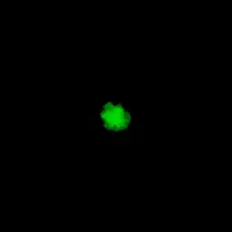

# Emission Method - что это такое и как этим пользоваться

От типа эмиссии зависит, как частицы будут "вылетать" из эммитера.

На текущий момент доступны следующие типы эмиссии:

* NumberPerSecond
* ConstantNumber
* NumberPerBurst

Остановимся на каждом из них подробно и с примерами. Подробно описывать все свойства не имеет смысла, так как это сделано в описании ноды.

## NumberPerSecond

Непрерывно генерируется *Number* количество частиц каждую секунду.

На примерах показано, как выглядит данный тип эмиссии, если генерировать 1, 10 и 100 частиц соответственно.

## ConstantNumber

Единоразово генерируется *Number* количество частиц. Они имеют флаг ImmortalParticles, следовательно будут лететь из эммитера вечно.

На примерах показано, как выглядит данный тип эмиссии, если генерировать 1, 10 и 100 частиц соответственно.

## NumberPerBurst

Единоразово генерится *Number* количество частиц по триггеру (анимируемый *Action*).

На примере показано, что сначала генерится 5, затем 10, 20 частиц, вплоть до 50 (для наглядности были использованы разные цвета). Все эти "импульсы" были вызваны через *Action* у одного эммитера.

## Сцена с примерами

В сцене [Particles.tan](media/Particles.tan) есть примеры использования всех описанных видов эмиссии. Нужно лишь включить нужный фрейм. Класть в ../Citrus/Samples/EmptyProject/Data и запускать из EmptyProject (работает везде, где есть Citrus)