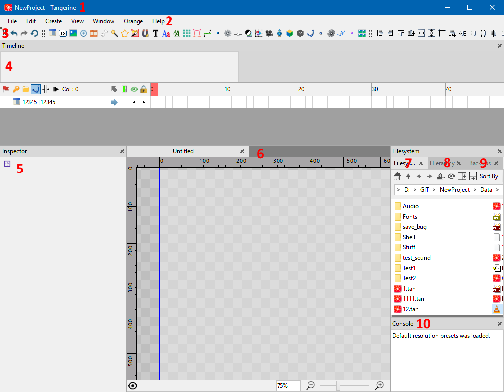

# Пользовательский интерфейс (UI)

**Главное окно Tangerine**

1. **Заголовок окна** - показывает имя открытого проекта и название редактора.
2. [**Панель меню**](menu_bar/menu_bar.md) - служит для отображения меню редактора.
3. [**Панель инструментов**](toolbar.md) - служит для отображения доступных инструментов редактора.
4. [**Окно "Timeline"**](timeline.md) - служит для отображения временной шкалы с кадрами и ключами анимации.
5. [**Окно "Inspector"**](inspector.md) - служит для отображения свойств выбранного объекта (ноды/виджета), с возможностью редактирования этих свойств.
6. [**Окно "Viewport"**](viewport.md) - служит для отображения текущей сцены. Всегда должно иметь как минимум 1 вкладку для отображения. Снизу находится статусбар, который, пока что, содержит в себе только ползунок с зумом.
7. [**Окно "Filesystem"**](filesystem.md) - файлменеджер для текущего проекта (и не только). Используется для навигации по файлам.
8. [**Окно "Hierarchy"**](hierarchy.md) - дерево и поиск объектов на сцене
9. [**Окно "Backups"**](backups.md) - управление бекапами сцены
10. [**Окно "Console"**](console.md) - используется для отображения различной технической информации и вывода ошибок.
11. [**Окно "Model3D Attachment"**](3d_attachment.md) - используется для настройки 3d-моделей. (по-умолчанию скрыто, вызывается через View -> Panels -> Model3D Attachment. Имеет смысл при работе с Model3D)
